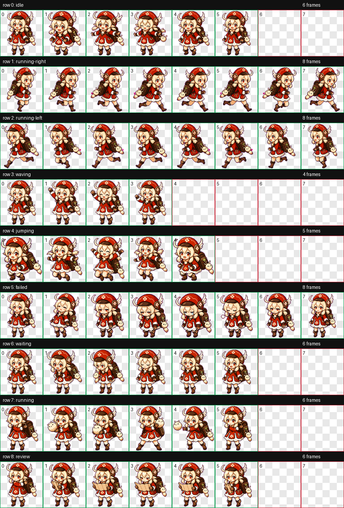

# Red Spark Codex 宠物

Red Spark 是一个自定义 Codex 动态宠物：戴红帽的 Q 版冒险者，带有背包、地图和白色吉祥物挂件。



## 安装

在本仓库中运行：

```powershell
.\scripts\install.ps1
```

也可以手动把宠物目录复制到 Codex 的 pets 目录：

```powershell
Copy-Item -Recurse -Force .\pets\red-spark "$env:USERPROFILE\.codex\pets\red-spark"
```

然后重启 Codex，或重新加载宠物列表。

## 编辑和重新构建

可编辑的源图位于 `assets/action-sheets/`。

如果只修改一个动画，编辑对应的 PNG，例如：

```text
assets/action-sheets/running.png
```

然后重新构建可安装的宠物包：

```powershell
.\scripts\build.ps1
```

构建脚本会复用本地 Codex 的 `hatch-pet` skill 脚本，并重新生成：

- `pets/red-spark/pet.json`
- `pets/red-spark/spritesheet.webp`
- `preview/contact-sheet.png`
- `preview/validation.json`
- `preview/review.json`

重新构建后，再运行一次安装脚本：

```powershell
.\scripts\install.ps1
```

## 构建要求

- Python 3.10 或更新版本。
- Pillow。
- 本地 Codex 已安装，并且 `hatch-pet` skill 位于：

```text
%USERPROFILE%\.codex\skills\hatch-pet
```

如需安装 Pillow：

```powershell
python -m pip install -r requirements.txt
```

## 文件

- `assets/action-sheets/*.png`：可编辑的动作条源图。
- `docs/hatch-pet-skill.md`：用于构建此宠物的 Codex `hatch-pet` skill 页面参考副本。
- `pets/red-spark/pet.json`：宠物清单文件。
- `pets/red-spark/spritesheet.webp`：`1536x1872` 的 RGBA 精灵图集。
- `preview/contact-sheet.png`：展示所有动画状态的 QA 联系表。
- `preview/validation.json`：图集校验输出。
- `preview/review.json`：帧提取和组件 QA 输出。
- `scripts/build.ps1`：从动作条源图重新构建宠物包。
- `scripts/install.ps1`：安装到本地 Codex pets 目录。
- `AGENTS.md`：供后续 Codex 工作使用的项目指导。

## 动画状态

- `idle`：有活力的待机循环。
- `running-right`：向右奔跑。
- `running-left`：向左奔跑。
- `waving`：开心打招呼。
- `jumping`：开心跳跃。
- `failed`：轻微失败反应。
- `waiting`：耐心等待循环。
- `running`：带着白色吉祥物挂件的进行中工作动作。
- `review`：从背包中取出小地图进行检查。

## 备注

最终图集已通过校验：尺寸为 `1536x1872`，格式为 `RGBA`，没有校验错误或警告。

`docs/hatch-pet-skill.md` 作为参考随仓库保存。实际构建仍会调用 `%USERPROFILE%\.codex\skills\hatch-pet\scripts` 下已安装的本地 skill 脚本。
